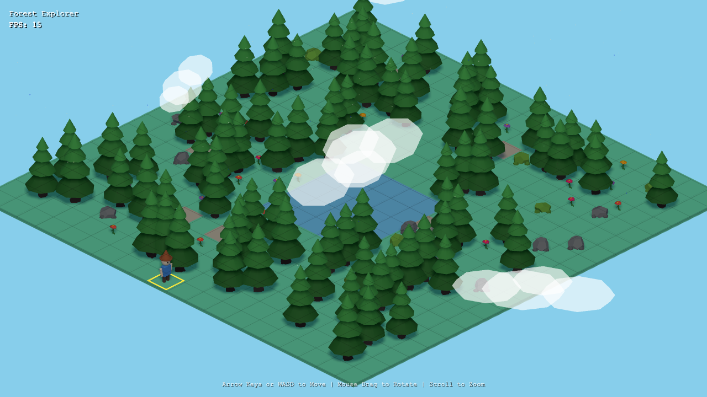

  

<h1 align="center">3D Forest Explorer</h1>

  

A browser-based 3D forest exploration game. Wander through a procedurally generated forest, chop down trees, and enjoy the peaceful pretentious atmosphere.

## Features

🌲 Procedurally generated forest with trees, rocks, flowers, and paths  
🪓 Interactive tree chopping  
☁️ Dynamic clouds and floating pollen particles  
🎥 Smooth camera with orbit controls

## Play

Serve the files with any static server:

| Command | Description |
|---------|-------------|
| `bunx serve .` | Using Bun |
| `npx serve .` | Using npm/npx |
| `python3 -m http.server` | Using Python |

Then open http://localhost:3000 (or http://localhost:8000 for Python)

## Controls

| Action | Input |
|--------|-------|
| Move | Arrow Keys / WASD |
| Rotate Camera | Mouse Drag |
| Zoom | Scroll Wheel |

---

## For Developers

**Tech Stack**: TypeScript + Three.js with zero build step (Babel transpiles `.ts` files at runtime in the browser)

**Run locally**: `bunx serve .` then open `index.html`

**Lint**: `bunx oxlint . --ignore-path .gitignore`

## License

MIT License
